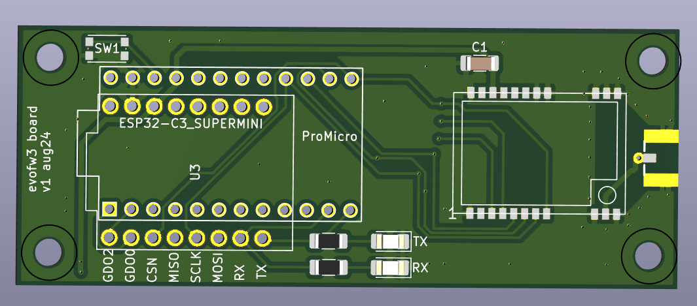
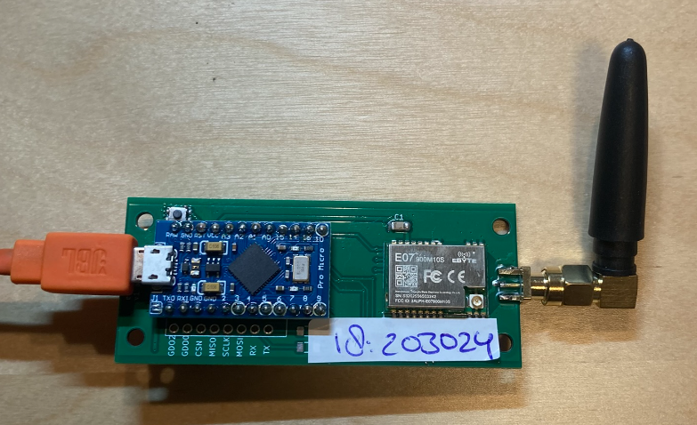
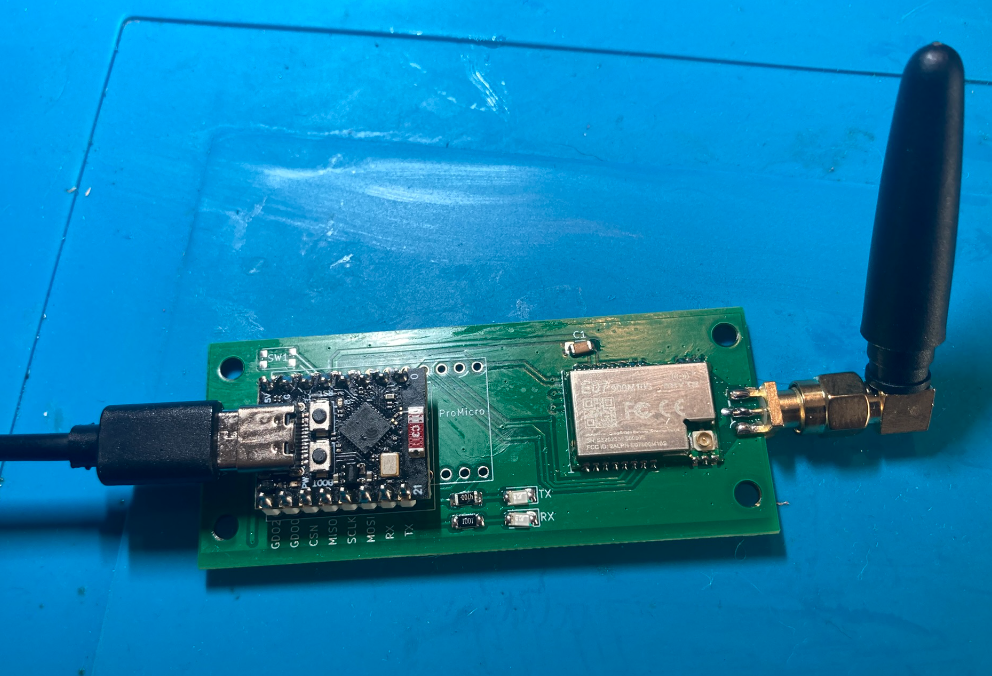

# e07-900m10s adapter board for Arduino Pro Micro (and esp32c3)
Adapter board for [ebyte e07-900m10s CC1101 module](https://www.ebyte.com/en/product-view-news.html?id=1567) and Arduino Pro Micro.

Using [evofw3](https://github.com/ghoti/evofw3) this is an Honeywell HGI-80 clone, that can be used to control Itho/Orcon fans (and evohome devices).
Use the [ramses_cc](https://github.com/zxdavb/ramses_cc) Home Assitant integration.

 - Arduino Pro Micro: mount the reset switch. The RX/TX LEDs are not used: The Pro Micro has on-board leds that are used by evofe3.
 - ESP32-C3: Optionally mount the RX/TX leds. Reset button is on-board. This can run ramses ESP.

TODO:
 - esp32c3 mosi/sclk/miso is the wrong way around!! MOSI = 10, SCLK 9... GPO0 6
